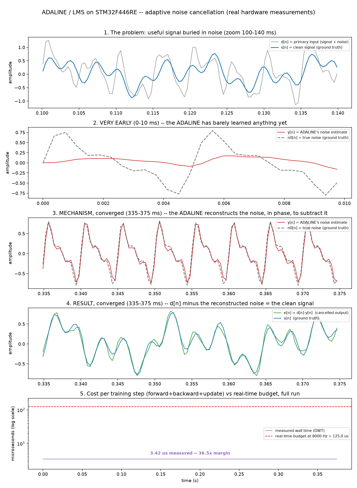

# On-target benchmarks

Everything on this page was measured on real hardware: an STM32F446RE
(Cortex-M4F, 168 MHz, FPU), flashed and read back over an ST-Link via
[`probe-rs`](https://probe.rs/), cycle counts from the DWT (Data Watchpoint
and Trace) unit, `DWT::cycle_count()` read around a `compiler_fence`-bounded
block to stop the optimizer from reordering the timed region relative to
the computation it's timing, the same failure mode this project's own
`compute.rs`/`regime_bench.rs` benches had already found and fixed with
`core::hint::black_box` on inputs, applied consistently here too.

Firmware source lives in the companion `frugal_ml-embedded` repository.
Analysis/plotting scripts live in [`benches/scripts/`](../benches/scripts/)
in *this* repo, next to the host-side Rust benches.

## Adaptive noise cancellation (ADALINE / LMS)

`Linear<16, 1, 16>` with no hidden layer, `mse`, `Sgd`: no new
`frugal_ml` primitive, this configuration alone reproduces the Widrow-Hoff
LMS update rule ([Widrow & Hoff, 1960][widrow60]) exactly. Trained online,
one sample at a time, against a simulated primary/reference microphone
pair: a clean multi-tone signal (`s[n]`, three sinusoids) mixed with
multi-harmonic noise (`n0[n]`, fundamental + two harmonics, engine-like),
a reference input correlated with the noise through an unknown 2-tap
coupling path but *not* with the signal: the standard adaptive-noise-
cancellation setup.

- Panel 1: the raw problem, the clean signal is not visible by eye in
  the mixed primary input.
- Panel 2 vs 3: the ADALINE's noise estimate `y[n]` against the true
  noise `n0[n]`, very early (barely trained) vs converged: correlation
  goes from 0.549 to 0.986.
- Panel 4: `e[n] = d[n] - y[n]` against the true clean signal, converged:
  this is the actual cancellation result.
- Panel 5: cost per training step across the whole run, against the
  real-time budget at the chosen sample rate.

**Numbers:**

| | value |
|---|---|
| cost per `forward`+`backward`+`update` | 575 cycles ≈ 3.42 µs |
| real-time budget at 8 kHz | 125 µs |
| margin | 36.5× |
| corr(y, n0), early → converged | 0.549 → 0.986 |
| RMS \|e−s\|, early → converged | 0.398 → 0.074 |

A methodological note worth keeping, because it cost real debugging time:
the first version of this benchmark used a single-frequency sine wave for
both signal and noise. A single tone has exactly two real degrees of
freedom (amplitude, phase); a 16-tap filter has sixteen. The learned
weights oscillated instead of settling cleanly, and the visible
before/after contrast was weak (correlation was already 0.99 in the
*first* few samples), not because learning wasn't happening, but because
the problem was underdetermined and easy to satisfy from almost any
starting point. Switching to multi-tone signal and multi-harmonic noise
(above) produced the clean, monotonic convergence shown here. A benchmark
that "passes" against a signal too simple to exercise the thing being
measured is not evidence.

## Bounds-checked vs unchecked tensor indexing

`Tensor::multiply` uses `get`/`set` (`debug_assert!`-guarded, compiles to
nothing in `--release`). `Tensor::multiply_unchecked` uses
`get_unchecked`/`set_unchecked`: same loop bounds, sound by construction
(the const generics backing the shapes already guarantee every index the
loop produces is in range). "The check disappears in release, so the two
should perform identically" turned out to be false, measured:

| | cycles/iter | |
|---|---|---|
| `multiply` (checked) | 263 | baseline |
| `multiply_unchecked` | 210 | **1.25×** faster |

Isolated matmul, 1×16 · 16×1 (the ADALINE's shape), 2000 iterations,
`black_box` on both operands each iteration to block constant-folding
across the loop (same pattern as `compute.rs`).

Wired into `Linear::forward`/`backward` end-to-end (full `train_step`,
3000 samples, `try_unchecked` branch, not yet merged to `main`):

| | cycles/sample |
|---|---|
| fully checked | 578 |
| `multiply` unchecked | 554 (-4.2%) |
| + `weights_grads` outer-product loop unchecked | 532 (**-8.0%** total) |

The isolated 25% gain dilutes to 8% end-to-end because the matmul is only
part of a training step's total cost: `mse`, the outer-product gradient
loop, and `Sgd::update` are unaffected by this specific change. Both
numbers are real; neither is the whole story on its own.

`cargo test --lib --tests`: 70/70 passing on both variants, including
`grad_check_*`: the speedup does not change the computed result.

## Classifier RAM ceiling

A `Then`-composed MLP (`Linear → ReLU → Linear → ReLU → Linear → Softmax`)
trained on-device against a synthetic multi-class dataset, generated on
target with the same Xorshift64 PRNG `Linear::from_seed` uses.

- `64 → 64 → 32 → 10`: trains cleanly, 300/300 final accuracy over 300
  epochs.
- `64 → 66 → 33 → 10` (+4% more parameters): fails, a corrupted return
  address executed as code (`MemManage Fault`, execute-never violation),
  the signature of a stack overflow that happens *during* execution, not
  at function entry.
- `64 → 68…160 → …`: fails immediately, before the first RTT line prints,
  because the entire stack frame for `main()` is reserved in one prologue
  instruction on function entry (`sub sp, sp, #N`), and for these sizes
  that single instruction already exceeds available stack.

Reading the linker symbols directly (`_stack_start - _stack_end`) gave
**126.4 KB** of real available stack. Reading the working `64→64→32→10`
build's own prologue gave **118.77 KB** reserved in that one instruction,
against a naive parameter-counting estimate (weights + gradients only) of
**50.5 KB**. A ~2.5× gap between "how much RAM the numbers need" and "how
much RAM the compiler actually reserves," found by bisecting real
hardware crashes, not predicted in advance. See the "what it costs you"
section of the top-level README for what this implies about the current
`Module` API and the planned fix.

[widrow60]: https://www-isl.stanford.edu/~widrow/papers/c1960adaptiveswitching.pdf
